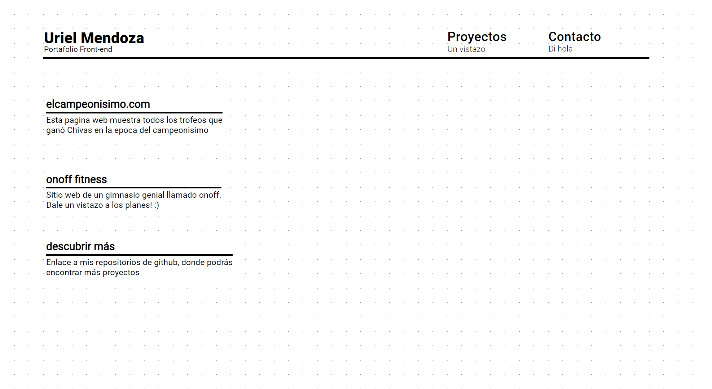

# Portafolio
Portafolio creado con HTML CSS Vanilla JS :) 

## Screenshot


### Installing

1. Clone the repo

```
git clone https://github.com/UrielMendozaG/portafolio.git
```

2. Open index file

```
open index.html
```

3. Explore

```
Enjoy :)
```

## Built with

* HTML 
* SASS 
* JAVASCRIPT


## Contributors

* **Uriel Mendoza** - *Initial work* -

## License

This project is licensed under the MIT License - see the [LICENSE.md](LICENSE.md) file for details

## Acknowledgments

* [Anime.js](https://animejs.com/) - Animacion de los elementos del DOM
